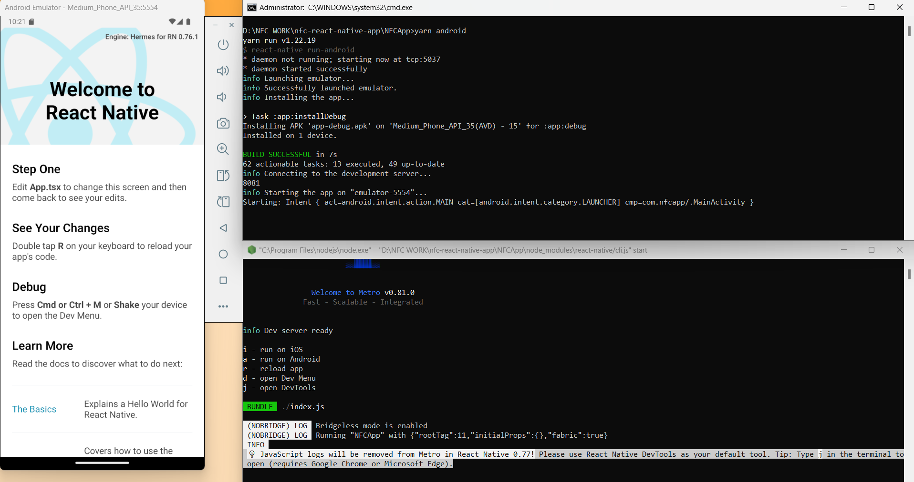

# NFC App in React Native

## Environment details 
`Used during development`

* Windows 11 Home
* OpenJDK-17 (others having compatible issue)
* Android Studio Version 2024.2
*  Android SDK Platform 35
* Android SDK Build-Tools 35.0.0
* NDK 26.3.11579264 (others having compatible issue)
* Node v20.10.0
* npm v10.2.5 
* npx v10.2.5
* yarn v1.22.19
* React Native v0.76.1
* Ensuring following Environment variables
    - JAVA_HOME
    - ANDROID_HOME
    - `[Path:]` %ANDROID_HOME%\emulator
    - `[Path:]` %ANDROID_HOME%\tools
    - `[Path:]` %ANDROID_HOME%\tools\bin
    - `[Path:]` %ANDROID_HOME%\platform-tools

## First Release (3rd November-2024)
Simple boilerplate react-native app successfully built and ran in emulator. It's a go signal for further development.

